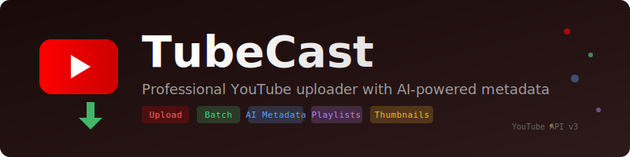

<p align="center">
  
</p>

<p align="center">
  <strong>Professional YouTube uploader with AI-powered metadata</strong>
</p>

<p align="center">
  <a href="https://pypi.org/project/tubecast/"></a>
  <a href="https://pypi.org/project/tubecast/"></a>
  <a href="https://github.com/sunil-dhaka/tubecast/blob/main/LICENSE"></a>
  <a href="https://www.python.org/"></a>
</p>

<p align="center">
  <a href="#installation">Installation</a> &bull;
  <a href="#quick-start">Quick Start</a> &bull;
  <a href="#features">Features</a> &bull;
  <a href="#commands">Commands</a> &bull;
  <a href="#ai-metadata">AI Metadata</a>
</p>

---

TubeCast is a professional CLI tool for uploading videos to YouTube with optional AI-powered metadata generation. It supports both interactive and command-line modes, batch uploads, and integrates with Google's Gemini AI for automatic title, description, and tag generation.

```
 _____     _          ___          _
|_   _|  _| |__  ___ / __| __ _ __| |_
  | || || | '_ \/ -_) (__/ _` (_-<  _|
  |_| \_,_|_.__/\___|\___|\__,_/__/\__|
```

## Features

| Feature | Description |
|---------|-------------|
| **Single Upload** | Upload videos with full metadata control |
| **Batch Upload** | Upload entire folders of videos at once |
| **AI Metadata** | Generate titles, descriptions, tags with Gemini |
| **Interactive Mode** | Beautiful TUI for guided uploads |
| **Video Management** | List videos, get info, manage playlists |
| **Custom Thumbnails** | Upload custom video thumbnails |
| **Resumable Uploads** | Automatic retry on network failures |

## Installation

```bash
# Using uv (recommended)
uv pip install tubecast

# Using pip
pip install tubecast
```

### Requirements

- **Python 3.10+**
- **YouTube API Credentials** - [Setup Guide](https://developers.google.com/youtube/v3/getting-started)
- **Gemini API Key** (optional) - [Get one free](https://aistudio.google.com/app/apikey)

## Quick Start

### 1. Setup (one-time)

```bash
tubecast setup
```

This will guide you through:
- Configuring YouTube OAuth credentials
- Setting up Gemini AI (optional)
- Choosing default preferences

### 2. Upload a video

```bash
# Interactive mode
tubecast

# Direct upload
tubecast upload video.mp4 --title "My Video" --description "Description"

# With AI-generated metadata
tubecast upload video.mp4 --ai
```

### 3. Get your video link

After upload, TubeCast displays:
- Watch URL: `https://youtu.be/VIDEO_ID`
- Studio URL: `https://studio.youtube.com/video/VIDEO_ID/edit`

## Commands

### `tubecast setup`

Configure credentials and preferences.

### `tubecast upload`

Upload a single video.

```bash
tubecast upload video.mp4                          # Interactive
tubecast upload video.mp4 --ai                     # AI metadata
tubecast upload video.mp4 -t "Title" -d "Desc"     # Manual metadata
tubecast upload video.mp4 --privacy public         # Set privacy
```

**Options:**
| Flag | Description |
|------|-------------|
| `-t, --title` | Video title |
| `-d, --description` | Video description |
| `--tags` | Comma-separated tags |
| `-p, --privacy` | public, unlisted, private |
| `-c, --category` | Category ID |
| `--ai` | Use AI for metadata |
| `-i, --interactive` | Force interactive mode |

### `tubecast batch`

Upload multiple videos from a folder.

```bash
tubecast batch ./videos/                # Upload all videos
tubecast batch ./videos/ --ai           # With AI metadata
tubecast batch ./videos/ -p public      # Set privacy for all
```

JSON metadata files (same name as video) are auto-detected:
```json
{
  "title": "My Video Title",
  "description": "Video description...",
  "tags": "tag1,tag2,tag3"
}
```

### `tubecast list`

List your uploaded videos.

```bash
tubecast list              # List 10 videos
tubecast list -n 25        # List 25 videos
```

### `tubecast playlists`

List your playlists.

### `tubecast info`

Get detailed info about a video.

```bash
tubecast info VIDEO_ID
```

## AI Metadata

TubeCast can automatically generate optimized metadata using Google's Gemini AI.

### Available Models

| Model | Description |
|-------|-------------|
| `gemini-3-pro-preview` | Latest, most capable (Recommended) |
| `gemini-2.5-pro` | Enhanced reasoning |
| `gemini-2.5-flash` | Fast and efficient |

### What AI Generates

1. **Title** - SEO-optimized, catchy (max 100 chars)
2. **Description** - Detailed with keywords, hashtags, CTAs
3. **Tags** - 10-15 relevant keywords for discoverability

### Enable AI

```bash
# During setup
tubecast setup

# Or per-upload
tubecast upload video.mp4 --ai
```

## Configuration

Config stored at `~/.tubecast/config.json`:

```json
{
  "gemini_api_key": "your-key",
  "gemini_model": "gemini-3-pro-preview",
  "default_privacy": "unlisted",
  "default_category": "22",
  "ai_enabled": true,
  "made_for_kids": false,
  "contains_synthetic_media": true
}
```

## YouTube API Setup

1. Go to [Google Cloud Console](https://console.cloud.google.com/)
2. Create a new project
3. Enable **YouTube Data API v3**
4. Create **OAuth 2.0 credentials** (Desktop app)
5. Download `client_secret.json`
6. Run `tubecast setup` and provide the file path

### API Quotas

| Operation | Cost |
|-----------|------|
| Upload video | 1,600 units |
| List videos | 1 unit |
| Get video | 1 unit |
| Update video | 50 units |

Daily quota: 10,000 units (6 uploads/day by default)

## Interactive Mode

Run `tubecast` without arguments for the full interactive experience:

```
What would you like to do?
> Upload a video
  Upload folder (batch)
  List my videos
  List my playlists
  Get video info
  Settings
  Exit
```

## Privacy Options

| Option | Description |
|--------|-------------|
| `public` | Anyone can search and watch |
| `unlisted` | Only people with link can watch |
| `private` | Only you can watch |

## Video Categories

| ID | Category |
|----|----------|
| 1 | Film & Animation |
| 10 | Music |
| 17 | Sports |
| 20 | Gaming |
| 22 | People & Blogs |
| 24 | Entertainment |
| 27 | Education |
| 28 | Science & Technology |

## License

MIT

---

<p align="center">
  Built with YouTube Data API v3 and Google Gemini
</p>

Sources:
- [YouTube Data API](https://developers.google.com/youtube/v3)
- [Google Gemini](https://ai.google.dev/)
